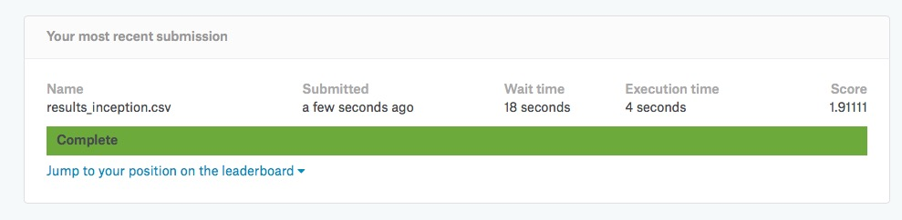

# Dog classification from Kaggle

The dog classification project came from kaggles website at https://www.kaggle.com/c/dog-breed-identification.  The purpose was to use a deep neural net with years to train the computer to predict images of dogs and classify them to 1 of 120 different breeds.  
Classification of dogs

The first step was to import the data and format including resizing it and converting the data to float32 and normalizing the color pixels from 1 to 255 to 0 to 1 using the code seen below.

```python
  i = 0 
for f, breed in tqdm(df_train.values):
    img = cv2.imread('{}{}.jpg'.format(TRAIN_FOLDER,f))
    label = one_hot_labels[i]
    x_train_0.append(cv2.resize(img, (im_size, im_size)))
    y_train_0.append(label)
    i += 1
   ```
   
   Also, the data with split into testing and training set using the code below
   
   ```python
   X_train, X_test, y_train, y_test = train_test_split(x_train_raw, y_train_raw, test_size=0.2, random_state=1)

   ```
   
   After the data was in the correct format, I then used different methods to train the data.  The first one involved me using Keras to design a deep neural network from scratch.  The most successful of the three different types of deep neural networks that I created had a kaggle score of 4.65829 can be seen below

```python

def bn_model():
    # YOUR TURN
    # Create a model with four convolutional layers (2 repeating VGG type units) and 2 dense layers before the output
    # Use Batch Normalization for every conv and dense layers
    # Use dropout layers if you like
    # Use Adam optimizer

    model = Sequential()
    model.add(Conv2D(16, 3, input_shape=(im_size, im_size, 3)))
    model.add(BatchNormalization())
    model.add(Activation('relu'))
    model.add(MaxPooling2D(pool_size=(2, 2)))
    model.add(Conv2D(16, 3))
    model.add(BatchNormalization())
    model.add(Activation('relu'))
    model.add(MaxPooling2D(pool_size=(2, 2)))
    model.add(Dropout(0.2))
    model.add(Conv2D(32, 3))
    model.add(BatchNormalization())
    model.add(Activation('relu'))
    model.add(MaxPooling2D(pool_size=(2, 2)))
    model.add(Conv2D(32, 3))
    model.add(BatchNormalization())
    model.add(Activation('relu'))
    model.add(MaxPooling2D(pool_size=(2, 2)))
    model.add(Dropout(0.5))
    model.add(Flatten())
    model.add(Dense(256))
    model.add(BatchNormalization())
    model.add(Activation('relu'))
    model.add(Dropout(0.5))
    model.add(Dense(64))
    model.add(BatchNormalization())
    model.add(Activation('relu'))
    model.add(Dense(num_output))
    model.add(BatchNormalization())
    model.add(Activation('softmax'))
    model.compile(loss='categorical_crossentropy', optimizer='adam', metrics=['accuracy'])
    return model
```
The other type of deep neural network method I tried used previously defined nerual networks with assocaited weight functions.  Some of the previous generated models included mobilenet, inception, vgg16, and resnet50.  

The way I used these models can be seen below.

```python 

base_model = MobileNet(input_shape=(im_size, im_size, 3), include_top=False, weights='imagenet')

# Here we start with the base model
x = base_model.output
# Then we add pooling 2d and a FCC layer
x = GlobalAveragePooling2D()(x)
# let's add a fully-connected layer
x = Dense(1024, activation='relu')(x)
# and a logistic layer with the final guess
predictions = Dense(num_output, activation='softmax')(x)

# this is the model we will train
model = Model(inputs=base_model.input, outputs=predictions)

```

The best result from this model was with inception and had a kaggle score of 1.9111 which as seen below.  



   
   
